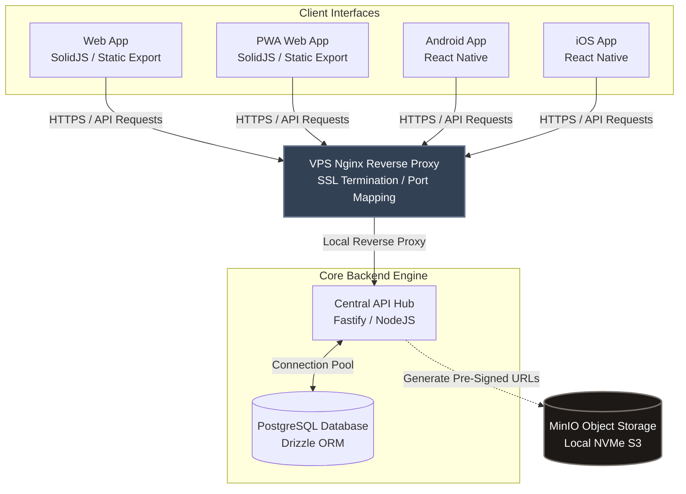

# lofipix

## Architecture

## Directory structure

| Path | Description | Technology |
| --- | --- | --- |
| `web/` | Web app | SolidJS + Vite, static export |
| `mobile/android/` | Android app | React Native |
| `mobile/ios/` | iOS app | React Native |
| `mobile/pwa/` | PWA | SolidJS + Vite + VitePWA |
| `api/` | Central API | Fastify + NodeJS + Drizzle ORM |
| `models/` | Shared Zod models & TypeScript types | TypeScript |
| `database/` | Database schema + SQL migrations | TypeScript + Drizzle ORM |
| `scripts/` | Shell commands, development tasks | Bash + TypeScript |
| `config/` | Application configuration | .conf, .toml, .env, TypeScript |

## General technologies

- **Frontend**: SolidJS, React Native, Tailwind CSS
- **Backend**: Node.js, Fastify, Drizzle ORM
- **Shared**: TypeScript, Zod, Shared Models
- **Database**: PostgreSQL
- **Storage**: MinIO (S3-compatible)
- **Infrastructure**: Docker, Docker Compose, Nginx
- **Deployment**: VPS, GitHub Actions
