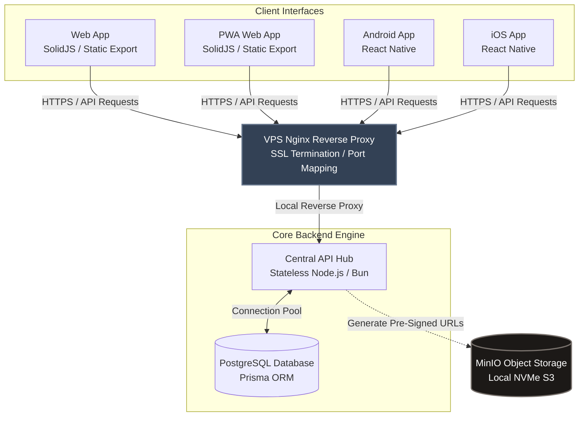

# lofipix

## Architecture



## Directory structure

```mermaid
graph TD
    ROOT["spaa (root)"] --> apps["apps/"]
    ROOT --> services["services/"]
    ROOT --> packages["packages/"]
    ROOT --> WS[["pnpm-workspace.yaml<br>Monorepo config"]]
    ROOT --> DC[["docker-compose.yml<br>Multi-container stack"]]

    apps --> web["web/<br>SolidJS + Vite Static Export"]
    apps --> mobile["mobile/"]
    mobile --> android["android/<br>React Native"]
    mobile --> ios["ios/<br>React Native"]
    mobile --> pwa["pwa/<br>SolidJS + Vite + VitePWA"]

    services --> api["api-hub/<br>JSON Stateless Controller"]

    packages --> core["core-models/<br>Zod Models & TS Types"]
    packages --> db[("database/<br>Schema + SQL Migrations")]